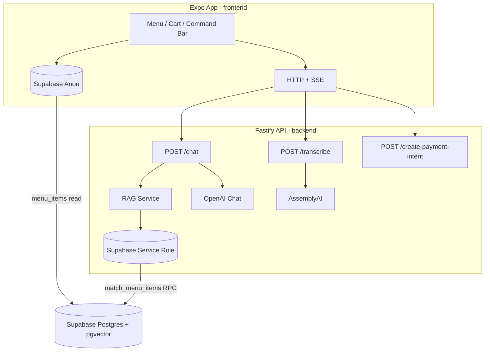

# The Intelligent Bistro

An AI-powered restaurant ordering experience: browse a live menu from Supabase, chat or speak natural-language orders, and let an LLM update your cart with retrieval-augmented context so suggestions stay grounded in real menu data.

The project is a **TypeScript monorepo** with an **Expo (React Native)** client and a **Fastify** API. There is no Python runtime; dependencies are managed with **npm** in `frontend/` and `backend/`.

---

## Features

- **Live menu** — Menu items load from Supabase (`menu_items`); optimized `FlatList` for large catalogs (250+ items) with responsive columns on web.
- **AI concierge** — Streamed chat via Server-Sent Events (SSE); GPT-4o-mini returns structured cart actions (add, remove, update quantity) with explicit-consent guardrails.
- **RAG** — User queries are embedded (`text-embedding-3-small`) and matched against menu vectors via Supabase `match_menu_items`.
- **Voice orders** — Record with `expo-audio`, transcribe through AssemblyAI, then send text into the same AI flow.
- **Cart state** — Zustand store with streaming tokens, action application, and a glass-style command bar UI (NativeWind, blur, gradients).
- **Cross-platform** — iOS, Android, and web from a single Expo codebase.

---

## Architecture



| Layer | Role |
|--------|------|
| **Frontend** | UI, cart, voice capture, direct Supabase reads for menu display |
| **Backend** | AI chat (SSE), transcription, embeddings + vector search (service role) |
| **Supabase** | `menu_items` table with `embedding` vectors; RPC for similarity search |
| **OpenAI** | Chat completions + embeddings |
| **AssemblyAI** | Speech-to-text for voice orders |

---

## Tech stack

### Frontend (`frontend/`)

| Category | Libraries |
|----------|-----------|
| Framework | Expo SDK 54, React 19, React Native 0.81 |
| Styling | NativeWind v2, Tailwind CSS 3 |
| State | Zustand |
| Data | `@supabase/supabase-js`, Axios |
| Streaming | `react-native-sse` |
| Media | `expo-audio`, `expo-image`, `expo-blur`, `expo-linear-gradient` |
| Animation | `react-native-reanimated` |

### Backend (`backend/`)

| Category | Libraries |
|----------|-----------|
| Server | Fastify 5, `@fastify/cors`, `@fastify/multipart` |
| Validation | Zod 4, `fastify-type-provider-zod` |
| AI / speech | OpenAI SDK, AssemblyAI SDK |
| Data | `@supabase/supabase-js` |
| Runtime | Node.js 20+, TypeScript, `tsx` (dev) |

---

## Project structure

```
The-Intelligent-Bistro/
├── frontend/                 # Expo React Native app
│   ├── App.tsx               # App shell, keyboard handling, chat/voice wiring
│   ├── src/
│   │   ├── components/       # MenuList, AiCommandBar, CartModal, …
│   │   ├── hooks/            # useMenuItems, useVoiceOrder, …
│   │   ├── services/         # chatStream, transcribeAudio
│   │   ├── store/            # useCartStore (Zustand)
│   │   └── lib/supabase.ts   # Public Supabase client
│   └── .env.example
├── backend/                  # Fastify API
│   ├── src/
│   │   ├── index.ts          # Routes: /health, /chat, /transcribe
│   │   ├── services/         # ai, rag, transcription
│   │   └── scripts/          # seedDatabase, generateMenu
│   ├── menu.json             # Seed data for npm run seed
│   └── .env.example
└── README.md
```

---

## Prerequisites

- **Node.js** 20 or newer
- **npm**
- [Expo Go](https://expo.dev/go) for menu/AI testing, or a **development build** for Stripe checkout (Payment Sheet does not run in Expo Go)
- Accounts / API keys for:
  - [Supabase](https://supabase.com) (Postgres + pgvector)
  - [OpenAI](https://platform.openai.com)
  - [AssemblyAI](https://www.assemblyai.com) (voice transcription)
  - [Stripe](https://stripe.com) (test-mode keys for Payment Sheet checkout)

---

## Supabase setup

The app expects:

1. A **`menu_items`** table with at least: `id`, `name`, `description`, `price`, `category`, `ingredients`, and an **`embedding`** column (`vector` type, pgvector extension enabled).
2. A Postgres function **`match_menu_items`** invoked by the backend RAG layer with parameters `query_embedding`, `match_threshold`, and `match_count` (defaults in code: threshold `0.3`, count `5`).
3. **Row Level Security** configured so the **anon** key can `SELECT` rows needed for the menu list (frontend reads directly from Supabase).
4. The **service role** key on the backend for RPC / seeding (never ship this key to the client).

Seed the database from `backend/menu.json`:

```bash
cd backend
cp .env.example .env   # fill in keys first
npm install
npm run seed
```

Optional: generate a new `menu.json` with OpenAI:

```bash
npm run generate-menu
```

---

## Environment variables

### Backend (`backend/.env`)

Copy from `backend/.env.example`:

| Variable | Description |
|----------|-------------|
| `OPENAI_API_KEY` | Chat + embeddings |
| `ASSEMBLYAI_API_KEY` | Voice transcription |
| `SUPABASE_URL` | Project URL |
| `SUPABASE_SERVICE_ROLE_KEY` | Service role (or `SUPABASE_KEY`) |
| `STRIPE_SECRET_KEY` | Stripe secret key (`sk_test_...`) for `/create-payment-intent` |
| `PORT` | API port (default `3000`) |

### Frontend (`frontend/.env`)

Copy from `frontend/.env.example`:

| Variable | Description |
|----------|-------------|
| `EXPO_PUBLIC_SUPABASE_URL` | Supabase project URL |
| `EXPO_PUBLIC_SUPABASE_ANON_KEY` | Public anon key (menu reads only) |
| `EXPO_PUBLIC_API_URL` | Backend base URL (see networking below) |
| `EXPO_PUBLIC_STRIPE_PUBLISHABLE_KEY` | Stripe publishable key (`pk_test_...`) for Payment Sheet |

Restart the Expo dev server after changing `.env` files.

### Stripe checkout (dev build required)

Payment Sheet uses `@stripe/stripe-react-native` native modules. After setting Stripe keys in both `.env` files and starting the backend:

```bash
cd frontend
npx expo run:ios    # or: npx expo run:android
```

Use test card `4242 4242 4242 4242` in the sheet. The backend exposes `POST /create-payment-intent` with body `{ "amount": <cents>, "currency": "usd" }`.

---

## Getting started

### 1. Backend

```bash
cd backend
npm install
cp .env.example .env
# Edit .env with your keys, then optionally:
npm run seed

npm run dev
```

The API listens on **`0.0.0.0`** (all interfaces) so physical devices on your LAN can reach it. Default: `http://localhost:3000`.

### 2. Frontend

```bash
cd frontend
npm install
cp .env.example .env
# Set Supabase + EXPO_PUBLIC_API_URL

npm start
```

Then press `i` (iOS simulator), `a` (Android emulator), or `w` (web).

### 3. Verify

```bash
curl http://localhost:3000/health
# {"status":"online","bistro":"ready for orders"}
```

---

## Networking (simulators vs physical devices)

| Environment | `EXPO_PUBLIC_API_URL` |
|-------------|------------------------|
| iOS Simulator / Web | `http://localhost:3000` (default) |
| Android Emulator | `http://10.0.2.2:3000` (auto-fallback if env unset) |
| Physical phone/tablet | `http://<your-computer-LAN-IP>:3000` |

Ensure the backend is running (`npm run dev` in `backend/`) and that your firewall allows inbound connections on the API port.

---

## API reference

### `GET /health`

Health check.

**Response:** `{ "status": "online", "bistro": "ready for orders" }`

### `POST /chat`

Streams AI order handling as **SSE**.

**Request body:**

```json
{
  "messages": [
    { "role": "user", "content": "Add a burger and fries" }
  ],
  "currentCart": [
    { "itemId": "uuid", "quantity": 1, "notes": "no onions" }
  ]
}
```

The last message must be from the user.

**SSE events:**

| Event | Payload | Meaning |
|-------|---------|---------|
| `token` | string | Streaming assistant text chunk |
| `final_action` | `OrderAction[]` | Cart mutations to apply |
| `action` | `{ conversationalResponse, actions }` | Final assistant payload |
| `error` | string | Terminal error message |

### `POST /transcribe`

Multipart upload of an audio file (max 10 MB).

**Response:** `{ "text": "transcribed utterance" }`

Uses AssemblyAI with configured speech models (`universal-3-pro`, `universal-2`).

---

## NPM scripts

### Frontend

| Script | Command |
|--------|---------|
| `npm start` | `expo start -c` |
| `npm run ios` | Expo → iOS |
| `npm run android` | Expo → Android |
| `npm run web` | Expo → web |

### Backend

| Script | Command |
|--------|---------|
| `npm run dev` | `tsx watch src/index.ts` |
| `npm run build` | Compile TypeScript → `dist/` |
| `npm start` | Run compiled server |
| `npm run seed` | Insert `menu.json` + embeddings |
| `npm run generate-menu` | Generate `menu.json` via OpenAI |

---

## AI behavior notes

The concierge is instructed to:

- Ground answers in **RAG-retrieved** menu items only (reduces hallucinated dishes).
- Require **explicit user confirmation** before `ADD` actions (suggestions and upsells use an empty `actions` array until the user agrees).
- Emit structured **`actions`** (`ADD`, `REMOVE`, `UPDATE_QUANTITY`, `NONE`) alongside a conversational reply.

Cart item resolution on the client still references `frontend/src/constants/menu.ts` for some ID/price lookups; the visible menu is loaded live from Supabase.

---

## Development tips

- **Hermes / SSE:** The frontend uses `react-native-sse` (XHR-based) because Hermes does not support `fetch` readable streams for SSE on device.
- **Blur on web/Android:** `expo-blur` is used on iOS; other platforms use a semi-opaque fallback for the glass UI.
- **Keyboard:** Android uses `softwareKeyboardLayoutMode: "resize"` and a screen-level `KeyboardAvoidingView` in `App.tsx`.
- **Voice cleanup:** Recordings are deleted via the Expo File API after transcription; local errors surface in `Alert`, not in the AI quote line.

---

## Security

- Never commit `.env` files or expose the **Supabase service role** or **OpenAI** keys in the Expo app.
- Use **anon** + RLS on the frontend; restrict writes and sensitive RPCs to the backend.
- CORS is currently `origin: '*'` — tighten for production deployments.

---

## License

No license file is included in this repository. Add one before distributing or open-sourcing the project.
